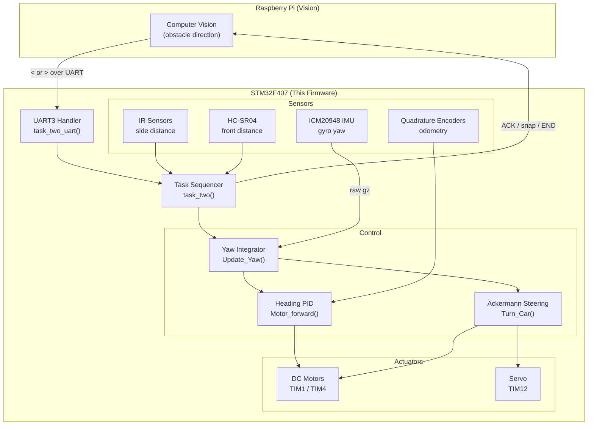

# MDP Task 2 — STM32 Autonomous Navigation Firmware

> Bare-metal STM32F407 firmware for an autonomous RC car that navigates a two-obstacle corridor, parks in a carpark bay, and returns to start — all without an RTOS.

## What is this?

The NTU SC2079 Multi-Disciplinary Project (MDP) challenges teams to build a fully autonomous robot that can navigate a physical obstacle course guided by a Raspberry Pi vision system. The STM32 is the motion-control brain: it receives obstacle directions from the Pi over UART (`<` = left, `>` = right), executes the avoidance sequence with millimeter-class precision, and sends back status messages (`ACK`, `snap`, `END`) to coordinate the RPi image-capture pipeline.

Task 2 is the hardest scenario: the car must approach Obstacle 1, dodge it using gyro turns and IR tracking, re-align to Obstacle 2, perform a 180° reversal around it, then arc back into the carpark bay — stopping flush against the rear wall based on live ultrasonic distance. Every maneuver is closed-loop; there are no fixed time delays for navigation.

This firmware is pure C on the STM32 HAL, running on a single blocking superloop with no RTOS. All sensor fusion, PID control, odometry, and task sequencing live in one file (`Core/Src/main.c`), making it easy to trace, tune, and flash from STM32CubeIDE.

---

## Key Innovations

### Trapezoidal gyro integration for yaw accuracy
Most hobbyist gyro integrations use a simple Euler step (`yaw += gz * dt`). This firmware uses the trapezoidal rule — averaging the current and previous corrected gyro sample before multiplying by `dt` — which halves first-order integration error at the same sampling rate. On a 200 Hz control loop, the reduction in drift is measurable over a 90° turn.

### Per-direction gyro bias scaling
The ICM20948 is not perfectly symmetric: the physical sensitivity and mechanical mounting mean that a left-turn at 90° and a right-turn at 90° produce slightly different integrated angles if treated identically. Two separate scale factors (`GYRO_LEFT_BIAS`, `GYRO_RIGHT_BIAS`) are applied depending on the sign of the bias-corrected gyro reading, calibrated empirically so both directions land on the correct angle without separate post-turn corrections.

### 13-point piecewise-linear IR LUT
The GP2Y0A21YK has a highly nonlinear voltage-to-distance curve with distinct near-field and far-field roll-off that no single power-law formula fits well across the full 5–70 cm range. Each sensor is individually characterised with 13 (mV, cm) measurement pairs; distance is computed by finding the enclosing segment and linearly interpolating within it. This yields sub-centimetre accuracy at the distances that matter for corridor tracking.

### Ackermann differential steering during turns
When the servo is turned to angle θ, the inner rear wheel traces a shorter arc than the outer wheel. `Turn_Car()` calculates the true inner-wheel turning radius from the measured wheelbase and track width (`R_inner = wheelbase / tan(θ)`), then scales the inner motor PWM by `R_inner / R_outer`. The result is a geometrically correct arc with no wheel scrub, which keeps the gyro-integrated heading accurate (no spurious yaw from tyre slip fighting the sensors).

### Motor vibration deadzone in gyro integration
DC motor PWM causes structure-borne vibrations that appear as low-level gyro noise. Without mitigation, these micro-rotations integrate continuously and accumulate into heading drift. A 1.5 dps deadzone is applied to the bias-corrected gyro signal before integration: signals below this floor are treated as zero. This was sized empirically to cancel idle vibration while passing real turn rates cleanly.

### Dual-exit turn termination with timeout
`Turn_Car()` accepts both a target angle and an optional target distance. The turn exits the moment *either* threshold is satisfied — the angle guard catches the normal case while the distance guard acts as a geometry safety net if the gyro diverges. An 8-second hard timeout catches mechanical failures (stalled motor, servo jam) so the car never gets stuck in a spin forever.

### IR-based reactive obstacle boundary detection
Rather than driving a fixed distance past each obstacle, the car watches the side IR sensor in a tight polling loop: it drives until the sensor transitions from "wall visible" to "wall gone" (or vice versa), using the IR to detect the physical edge of the obstacle. This makes navigation robust to obstacle placement variance without requiring precise absolute positioning.

---

## Architecture



**UART3 Handler** — interrupt-driven receive for `<`/`>` direction commands; polling fallback for the `snap` acknowledgement flow.

**Task Sequencer** (`task_two`) — top-level state machine: drives to Obstacle 1, dodges, repositions to Obstacle 2, performs 180° reversal, returns to carpark, and sends `END`.

**Yaw Integrator** (`Update_Yaw`) — bias correction → EMA filter → deadzone → trapezoidal integration. Called at ~200 Hz inside turn loops.

**Heading PID** (`Motor_forward`) — gyro-based straight-line correction; applies differential PWM to left/right motors to cancel heading error while driving forward.

**Ackermann Steering** (`Turn_Car`/`Turn_Car_Reverse`) — geometric inner-wheel speed reduction + dual-exit (angle OR distance) with 8 s timeout.

---

## Tech Stack

| Layer | Technology | Purpose |
|---|---|---|
| MCU | STM32F407VET6 @ 168 MHz | Main compute |
| HAL | STM32 HAL (CubeMX-generated) | Peripheral abstraction |
| Motors | TIM1 CH3/CH4, TIM4 CH3/CH4 | L/R DC motor PWM |
| Servo | TIM12 CH2, 500–2500 µs | Ackermann front steering |
| Encoders | TIM2 (left), TIM5 (right) | Quadrature odometry |
| IMU | ICM20948 via I2C2 | Yaw rate (gyro Z-axis) |
| IR distance | GP2Y0A21YK, ADC1 CH6/CH7 | Side obstacle clearance |
| Ultrasonic | HC-SR04, DWT cycle counter | Front stop distance |
| Display | SSD1306 OLED via I2C2 | On-car debug readout |
| Comms | UART3 @ 115200, UART2 @ 9600 | RPi link / Bluetooth |
| Build | STM32CubeIDE (Eclipse CDT) | Compile, flash, debug |

---

## Features

- Fully closed-loop navigation — no timed driving except as an emergency fallback
- Gyro-based heading hold (`Motor_forward`) keeps straight drives arrow-straight
- Per-surface tuning profiles (`TASK2_SURFACE_HPL`, `TASK2_SURFACE_OUTSIDE`) swap calibration constants at compile time
- Startup gyro bias calibration — 200-sample average taken before first move
- Speed ramping on all straight drives — 100% → 60% → 35% → 25% in the final centimetres before stop
- Reverse braking pulse — brief counter-pulse before motor stop eliminates coasting overshoot
- OLED live telemetry — yaw angle, target angle, PWM, distance displayed in real time
- UART protocol with retry — `snap` command waits up to 8 seconds, retries once on timeout, sends `timeout\n` on failure

---

## Hardware Pinout

| Peripheral | Timer / Pin | Notes |
|---|---|---|
| Motor A (left) | TIM4 CH3 / CH4 | CH3 = forward, CH4 = reverse |
| Motor D (right) | TIM1 CH3 / CH4 | CH3 = reverse, CH4 = forward (inverted wiring) |
| Servo | TIM12 CH2 | 500–2500 µs; center ≈ 1477 µs |
| Left encoder | TIM2 (PA15, PB3) | Counts up going forward |
| Right encoder | TIM5 (PA0, PA1) | Counts down going forward; flipped in code |
| IMU (ICM20948) | I2C2 | Auto-detected at 0x68 or 0x69 |
| OLED display | I2C2 | SSD1306-compatible |
| IR right | ADC1_IN6 (PA6) | GP2Y0A21YK, piecewise LUT |
| IR left | ADC1_IN7 (PA7) | GP2Y0A21YK, piecewise LUT |
| Ultrasonic front | TRIG = PB14, ECHO = PC9 | HC-SR04, DWT timing |
| UART / RPi | UART3 | 115200 baud |
| UART Bluetooth | UART2 | 9600 baud |

---

## Getting Started

### Prerequisites

| Tool | Version | Notes |
|---|---|---|
| STM32CubeIDE | ≥ 1.13 | Download from st.com |
| ST-Link V2 (or onboard) | any | USB debugger/programmer |
| STM32F407VET6 board | — | Custom MDP robot PCB |

STM32CubeIDE includes all compiler toolchains (ARM GCC) — no separate installation needed.

### 1. Clone the repository

```bash
git clone https://github.com/SC2079-MDP-AY2526S2-Grp-11/STM32Code.git
cd STM32Code
```

### 2. Open in STM32CubeIDE

**File → Open Projects from File System** → point to the cloned directory. The `.project` and `.cproject` files are checked in; the project imports as-is.

### 3. (Optional) Regenerate HAL init code

If you need to change peripheral configuration, open `Lab4.ioc` inside STM32CubeIDE and click **Generate Code**. Do not manually edit any `MX_*_Init` function — CubeMX will overwrite it.

### 4. Select a surface profile

In `Core/Src/main.c`, line 67, set the surface for your test environment:

```c
TASK2_Surface_t TASK2_current_surface = TASK2_SURFACE_HPL;   // indoor lab
// TASK2_Surface_t TASK2_current_surface = TASK2_SURFACE_OUTSIDE; // outdoor
```

### 5. Build and flash

1. Connect the ST-Link to the board.
2. **Project → Build Project** (Ctrl+B) — the build output appears in the Console.
3. **Run → Run** — CubeIDE flashes and starts the program.

On startup the OLED shows `ICM @0x6X` (IMU address) then `ICM OK` while the gyro bias calibration runs (~1 second of stillness required).

### 6. Start a run

Send a single character over UART3 at 115200 baud:

| Command | Effect |
|---|---|
| `<\n` | Start Task 2 with Obstacle 1 on the left |
| `>\n` | Start Task 2 with Obstacle 1 on the right |

The firmware will reply `ACK\n`, execute the course, send `snap\n` when in position for the Obstacle 2 photo, wait for `<` or `>` from the RPi, then complete the return and send `END\n`.

---

## Calibration

When porting to a new surface or after hardware changes, adjust these constants in order:

| Constant | Location | Effect |
|---|---|---|
| `COUNTS_PER_CM_L/R` | top of main.c (~line 86) | Straight-line distance accuracy |
| `SERVO_CENTER_US` | top of main.c (~line 93) | Servo trim; eliminates straight-line drift |
| `left_offset` in `Motor_forward` | ~line 402 | Motor balance; corrects residual straight drift |
| `GYRO_LEFT_BIAS` / `GYRO_RIGHT_BIAS` | top of main.c (~line 101) | Turn angle accuracy left vs right |
| `TASK2_obs_1/2_clearance_distance` | top of main.c | Stop distance from obstacles |
| `TASK2_vertical_dist_return_arc_buffer` | top of main.c | When to begin the return arc |

---

## UART Protocol (STM32 ↔ Raspberry Pi)

```
RPi  →  STM32   "<\n"  or  ">\n"     obstacle direction
STM32 → RPi     "ACK\n"              command acknowledged
STM32 → RPi     "snap\n"             request camera snapshot (Obstacle 2)
RPi  →  STM32   "<\n"  or  ">\n"     Obstacle 2 direction
STM32 → RPi     "ACK\n"              Obstacle 2 acknowledged
STM32 → RPi     "END\n"              task complete
```

On timeout (8 s with one retry) the STM32 sends `"timeout\n"` and defaults to `'<'` for the missing direction.

---

## License

Academic project — NTU SC2079 AY2526 Semester 2, Group 11.
